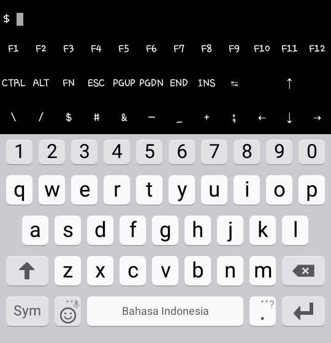

![ChiLi_Cyber]


# Termux Key by ChiLi_Cyber
Is a tool for add modification keys to your Termux app.

## How to install

* `$ pkg update && pkg upgrade`
* `$ pkg install python`
* `$ pkg install git`
* `$ git clone https://github.com/karjok/terkey`
* `$ cd terkey`
* `$ python terkey.py && cp .termux $HOME/.termux`


Or you can just copy code bellow and paste to your Termux app and of course, press enter !

```pkg update && pkg upgrade;pkg install python git;git clone https://github.com/karjok/terkey;cd terkey;python terkey.py;cp .termux $HOME/.termux```

## Feature !